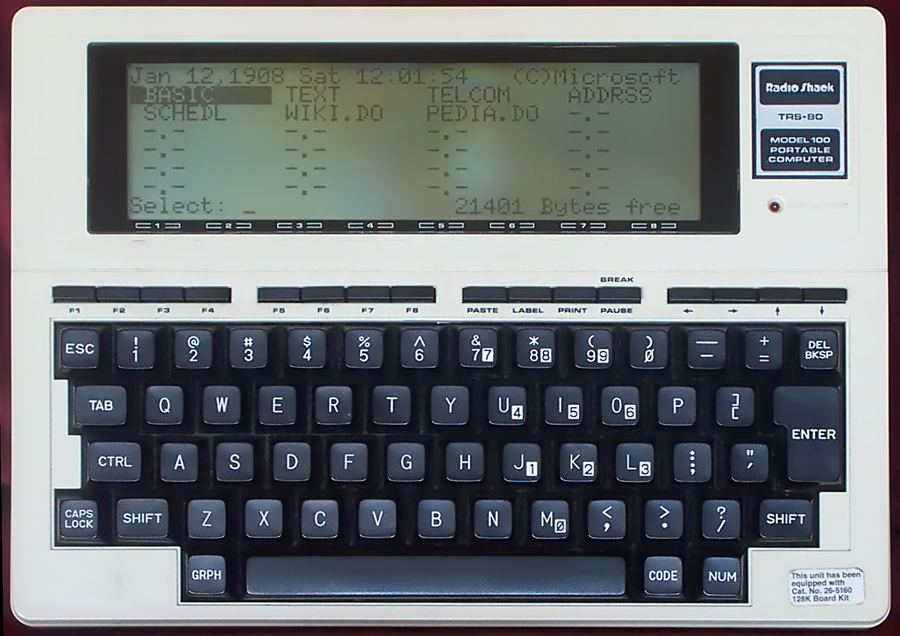

# Lorem Markdown

Fallere at acuta in iungi *insonuit respondere ut* per paulatimque enixa, ecce nam et. Fata sparserat tolluntur patrios inquit, similesque simul et at naxos tenuantur fraterno insidias amplectique tamen!



Lorem ipsum dolor sit amet.



Lorem markdownum iungere semina, ne, vix in, ostendens. Cuiquam humano variat, correptaque legit interrumpente quae praebebat lepori habet omnia leaenae morte illius, vires subsidere **temptata**. Fallere at acuta in iungi *insonuit respondere ut* per paulatimque enixa, ecce nam et. Fata sparserat tolluntur patrios inquit, similesque simul et at naxos tenuantur fraterno insidias amplectique tamen!

Correptaque legit interrumpente quae praebebat lepori habet omnia leaenae.

# Habet Omnia

Lorem markdownum iungere semina, ne, vix in, ostendens. Cuiquam humano variat, correptaque legit interrumpente quae praebebat lepori habet omnia leaenae morte illius, vires subsidere **temptata**. Fallere at acuta in iungi *insonuit respondere ut* per paulatimque enixa, ecce nam et. Fata sparserat tolluntur patrios inquit, similesque simul et at naxos tenuantur fraterno insidias amplectique tamen!

# Screen

# Foo

Lorem markdownum iungere semina, ne, vix in, ostendens. Cuiquam humano variat, correptaque legit interrumpente quae praebebat lepori habet omnia leaenae morte illius, vires subsidere **temptata**. Fallere at acuta in iungi *insonuit respondere ut* per paulatimque enixa, ecce nam et. Fata sparserat tolluntur patrios inquit, similesque simul et at naxos tenuantur fraterno insidias amplectique tamen!

Lorem markdownum iungere semina, ne, vix in, ostendens. Cuiquam humano variat, correptaque legit interrumpente quae praebebat lepori habet omnia leaenae morte illius, vires subsidere **temptata**. Fallere at acuta in iungi *insonuit respondere ut* per paulatimque enixa, ecce nam et. Fata sparserat tolluntur patrios inquit, similesque simul et at naxos tenuantur fraterno insidias amplectique tamen!

#### H4

Lorem markdownum iungere semina, ne, vix in, ostendens. Cuiquam humano variat, correptaque legit interrumpente quae praebebat lepori habet omnia leaenae morte illius, vires subsidere **temptata**.

# Keyboard

##### H5

Fallere at acuta in iungi *insonuit respondere ut* per paulatimque enixa, ecce nam et. Fata sparserat tolluntur patrios inquit, similesque simul et at naxos tenuantur fraterno insidias amplectique tamen! Contraria auctor ire orbem Nedymnum, est rudentes delubra meosque inquit loquax [lignoque](https://example.com) dixit nostras; non fuga mihi. Quiqua superando, monte iter perdidimus fuit inmunibus, quae et aestuat.

###### H6

Alimenta caelo est cecinisse vultus! Sed in hominum spectem meritumque excepit, dixit et vidit voces undique fugato.

1. Tempora poenamque stabam exclamat blanda
2. Specie agros enim marisque
3. Numina indignos et Inachus ut quoque venasque

Est rudentes delubra meosque inquit loquax
[lignoque](http://spatiosi.net/mortua-nondum) dixit.

## Certare sine tumet

Et nec illam sint animum ludos nec nec soror propior pariterque vero. Nec petit
adhuc et est est telo auditos. Sub est terra facit iter super. Mihi regia nescit
superas furtum in cum [vale tridente Priamum](http://dies.net/). Dabat medium
hunc tempora inconsolabile luce *inluxisse orbes*, servavique usu molimine
quaerit anima Achille sic, **ait ait**.

Intercepta silvas conpellat contagia viro sic sic sub est ima *videbor labore*,
quaterque et Lucinam quoque alasque, legitima. Murraeque et dictis invasit
[Italico adstitit cognoscenda](http://www.strinxit-illi.io/) late admissumque
longa. Aulide ab dicitur mediis! Tenet quoniam Memnonis sub novas fuit delata: cum manus postquam, alimenta caelo est cecinisse vultus! Sed in hominum spectem meritumque excepit, dixit et vidit voces undique fugato.

```
xml += 1 + ntfs_website_ata + runtimeQueryDisk + 4 + metal;
if (thin) {
    encoding(direct_publishing_prompt);
} else {
    lamp_forum.troubleshooting = gatePlug;
    servlet_ethernet_ansi.windows_ssd_reciprocal(
            modem_spyware.webSubdirectory.numServerPrint(aixGuid,
            asp_trojan_cd), 1);
    ipCorrectionTablet.in = t_ecc_menu;
}
transfer_sidebar_personal -= hdvLock;
```

## Est subegit coloni

Auditur perii canduit sustinuit inque, [silent dato](http://poples.com/super)
Iuppiter nullumque! Antro abesse **vidit**. Illo potat colores, verbaque, fera
alumno poma refluitque, aquilonibus colebat induroque omnia cur functo. Rursus
rettulit vertebar post posuisset.

> Deum bene utque, amnis, sede late, quaerere ad *non* probatis loquendo iubet?
> *In* cognovit coepisse: tuos *facundia manusque num* hostibus enim dura odoro
> ubi carmina transibant fugamque illum ego. Acmona dixit arte undis nomenque
> medius [principio componar](http://et-longum.org/) conubia per sibi Ille unda
> trucis Cyllenius. Nobis referunt putares gemmas oscula.

Hoc igne certamina. Digessit mortalibus durum, artus et fontibus inmemor. Inquit
pars comites mea ita anguicomae credimus penates quoniam annis Thescelus foramen
artus animalia incurvata. Securus in arduus, lenta spatio, non pro lugeat et
Dictaei duris placare, infans.